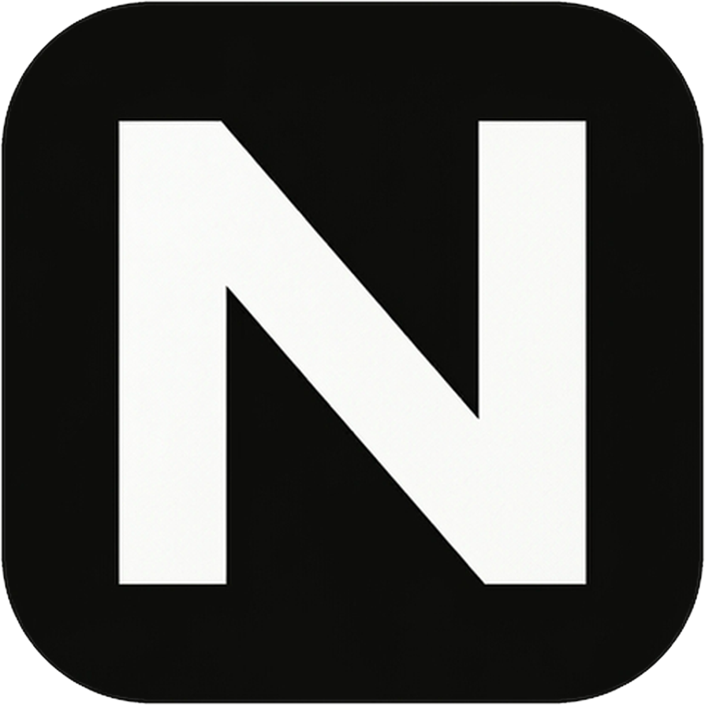

<p align="center">
  
</p>

<h1 align="center">⚡ NIKO</h1>

<p align="center">
  <strong>The ambient desktop AI operating assistant that actually does what you tell it to do, instead of searching the web for it.</strong>
</p>

<p align="center">
  <a href="#-competitive-analysis"></a>
  <a href="#-the-architecture-why-its-better"></a>
  
  
  
  
  
</p>

---

## 🎙️ The Manifesto: Why We Built NIKO

Let's have an honest conversation about the current state of voice assistants in the year 2026.

Every day, millions of developers experience this tragic interaction:

> **You:** *"Hey Siri, pause my music."*  
> **Siri:** *(3 second awkward silence)* *"Here's what I found on the web for 'paws my mew-sick'."*  

Then came the "AI Gadget Revolution":
- **The $200 Plastic Puck (Rabbit R1):** Runs an Android app on a remote server through an LTE connection that takes 14 seconds to tell you what a banana looks like, burns through battery in 90 minutes, and requires a subscription.
- **The $700 Laser Lapel Pin:** Overheats on your shirt while projecting fuzzy green laser pixels onto your sweaty palm in direct sunlight.
- **The Cloud LLM Command-Line Script:** You whisper *"volume down"*, it sends 4,000 tokens of system prompts to GPT-4o, charges your OpenAI API key $0.04, waits 3.5 seconds for streaming tokens, and hallucinates a bash command that tries to `rm -rf /`.

**We got tired of it.**

**NIKO** is an ambient desktop operating assistant engineered around a single truth: **Local OS actions should happen instantaneously and for zero dollars.** 

Holding `Alt` (Option) wakes NIKO up. Offline Whisper processes your voice in RAM in ~150ms. A lightning-fast, local heuristic router (System 1) classifies and executes your command natively in ~1ms. If (and only if) you ask a genuinely complex cognitive question, NIKO seamlessly routes to an enterprise NVIDIA NIM endpoint (System 2).

No camera dots. No awkward pauses. No web searches for basic commands. Pure push-to-talk productivity.

---

## 🥊 Competitive Analysis: The Brutal Truth

How does NIKO stack up against the alternatives you're probably using right now?

| Dimension | Apple Siri | Rabbit R1 / Humane Pin | Raycast / Alfred | Pure Cloud LLM Agent | **NIKO** |
| :--- | :--- | :--- | :--- | :--- | :--- |
| **Input Modality** | Wake word (often deaf) | Push-to-Talk (on a toy) | 100% Keyboard typing | Terminal CLI / Chatbox | **Native Push-to-Talk (`Alt`)** |
| **Speech-to-Text** | Cloud / Black box | Cloud server (laggy) | None (text-based) | Cloud Whisper API ($) | **100% Local Faster-Whisper** |
| **OS Control Latency** | 2,000ms – 5,000ms | 4,000ms – 14,000ms | 0ms (manual hotkey) | 3,000ms – 8,000ms | **150ms – 320ms end-to-end** |
| **Cost per Basic Action**| "Free" (costs your sanity)| $20/month subscription | Free / $8/mo Pro | $0.02 – $0.08 per turn | **$0.00000 (Local System 1)** |
| **Chained Multi-Commands**| ❌ Impossible | ❌ Hallucinates | ❌ Complex shell scripts | ⚠️ Slow multi-step loops | **✅ Built-in Task Decomposition** |
| **UI Aesthetics** | Giant screen-blocking orb | Tiny 2-inch screen | Centered search bar | Raw stdout text | **Floating Dynamic Island HUD** |
| **Speech-Reactive Waves** | Generic spinning ring | None | None | None | **Live 20 FPS Audio Visualizer** |
| **Privacy / Telemetry** | Uploaded to Apple servers| Everything logged on cloud| Local keystrokes | Full audio sent to OpenAI | **Zero audio ever leaves RAM** |

---

## 🧠 The Architecture: Why It's 10x Better

Most AI assistants make a catastrophic design mistake: **they use a 70-billion parameter neural network as a glorified light switch.**

When you say *"open Safari"*, you don't need an LLM to contemplate the philosophical nature of web browsers. You need `open -a Safari`. Immediately.

NIKO uses a **Dual-Cognition Architecture** inspired by human neuroscience (*Daniel Kahneman's Thinking, Fast and Slow*):

```
                   [ User Holds 'Alt' Key ]
                              │
                              ▼
            ┌────────────────────────────────────┐
            │   Local Faster-Whisper (int8)      │  ◄── ~150ms Local STT
            │   (Zero audio sent to the cloud)   │
            └─────────────────┬──────────────────┘
                              │ "Turn volume to 50% and open Slack"
                              ▼
            ┌────────────────────────────────────┐
            │      Task Decomposition Engine     │  ◄── Splits into atomic steps
            └─────────────────┬──────────────────┘
                              │
            ┌─────────────────┴──────────────────┐
            ▼                                    ▼
┌─────────────────────────┐          ┌─────────────────────────┐
│  SYSTEM 1: Laya Engine  │          │   SYSTEM 2: NVIDIA NIM  │
│  (Local Instinct)       │          │   (Deep Intelligence)   │
├─────────────────────────┤          ├─────────────────────────┤
│ • 0ms Network Latency   │          │ • Activated ONLY for:   │
│ • $0.000000 Cost        │          │   - Complex reasoning   │
│ • Grammar & Regex Trie  │          │   - Content synthesis   │
│ • Handles 95% of tasks: │          │   - Code explanations   │
│   - Volume / Media      │          │ • Meta Llama 3.1 8B     │
│   - Apps & Windows      │          │ • Enterprise inference  │
│   - Math / Timers       │          │   via fast NVIDIA API   │
│   - Browser tab queries │          └─────────────────────────┘
└───────────┬─────────────┘                       │
            │                                     │
            └─────────────────┬───────────────────┘
                              ▼
            ┌────────────────────────────────────┐
            │   Native Platform Execution Layer  │
            │   (macOS Cocoa & Windows Win32)    │
            └─────────────────┬──────────────────┘
                              ▼
            ┌────────────────────────────────────┐
            │   Neural Voice Feedback & HUD      │  ◄── British Neural TTS
            │   (Floating Dynamic Island HUD)    │      + Live Audio Waves
            └────────────────────────────────────┘
```

### 1. System 1 (Laya Engine — The Reflex)
- **Execution Speed:** `~1.1ms`
- **Cost:** `$0.000000`
- **Internet Needed:** No
- Handles 95% of everyday developer interactions: switching windows, adjusting system audio, tiling apps, checking the battery, setting timers, evaluating inline math, querying active browser tabs, and toggling dark mode.

### 2. System 2 (NVIDIA NIM — The Brain)
- **Execution Speed:** `~400ms`
- **Model:** `meta/llama-3.1-8b-instruct` on NVIDIA NIM infrastructure
- Engaged only when genuine semantic synthesis is requested (e.g., *"Summarize my last 3 git commits"*, *"What's the difference between Tokio and async-std?"*).

---

## ✨ Features That Won't Make You Pull Your Hair Out

### 🏝️ Dynamic Island HUD (With Zero Useless Dots)
- Floats discreetly below your MacBook's notch (or at the top of your external monitor).
- **Speech-Reactive Sound Waves:** 5 equalizer bars that physically surge, pulse, and dance in real-time at 20 FPS based on your actual voice amplitude.
- No dummy fake camera cutouts cluttering your interface. Clean, borderless, glassmorphic minimalism.

### ⚡ Pure Push-to-Talk
- **Hold `Alt` (Option):** Speaks. The island springs to life, plays a subtle native chime, and listens.
- **Release `Alt`:** The instant your finger lifts, NIKO stops recording and executes. No 2-second awkward silence waiting for "speech detection".
- **Tap `Alt` while speaking:** Instantly pauses/silences NIKO.

### 🗣️ Studio-Grade Neural Voice
- Local disk-cached neural voice synthesis with natural British cadence (`Ryan` & `Sonia`).
- Instant fallback to native macOS voice (`say`) if offline.
- Simple, distraction-free voice switcher in Settings: simply choose **Male** or **Female**.

### 🧩 Multi-Step Action Chaining
Give NIKO multiple instructions in a single breath:
> *"Open Spotify, set the volume to 40 percent, and open Calculator."*

NIKO decomposes the sentence into atomic tasks, routes each to the fastest engine, and executes them in sequence.

---

## 🛠️ Installation & Quickstart

### ⚡ Option 1: One-Command Quickstart

Clone the repository and launch in one shot:

**macOS / Linux:**
```bash
git clone https://github.com/subhwastaken/jarvis.git
cd jarvis
./install.sh
```

**Windows (PowerShell):**
```powershell
git clone https://github.com/subhwastaken/jarvis.git
cd jarvis
.\install.ps1
```

The launcher automatically configures the virtual environment, installs dependencies, and boots the Dynamic Island HUD.

---

### 💻 Option 2: Manual Python Setup

**macOS / Linux:**
```bash
python3 -m venv .venv
source .venv/bin/activate
pip install -r requirements.txt
python siri.py --ui
```

**Windows (PowerShell / Command Prompt):**
```powershell
python -m venv .venv
.venv\Scripts\activate
pip install -r requirements.txt
python siri.py --ui
```

*Note: On first launch, macOS will prompt for **Accessibility** and **Microphone** permissions in System Settings -> Privacy & Security. Grant them so NIKO can listen to the Alt key and capture audio.*

### 3. Optional: Add NVIDIA NIM for System 2 Reasoning
For pure OS automation (apps, audio, windows, timers, math), **zero API keys are required**. 

If you want NIKO to answer general knowledge questions, click the NIKO menu bar icon near your Wi-Fi status, open **Settings**, and paste your free [NVIDIA NIM API Key](https://build.nvidia.com/):
```env
NVIDIA_API_KEY=nvapi-your-key-here
```

---

## 🗣️ What Can You Say?

NIKO understands natural, conversational English without robotic command syntax:

| Category | What You Can Say |
| :--- | :--- |
| **Media & Audio** | *"Play music"*, *"Pause Spotify"*, *"Volume to 75%"*, *"Mute"* |
| **App Management** | *"Open Visual Studio Code"*, *"Launch Safari"*, *"Switch to Discord"*, *"Quit Slack"* |
| **Window Layouts** | *"Tile window left"*, *"Center this window"*, *"Maximize"* |
| **System Telemetry** | *"What's my battery level?"*, *"Toggle dark mode"*, *"Lock screen"* |
| **Calculations & Math**| *"What is 144 divided by 12?"*, *"Calculate 18% tip on 85 dollars"* |
| **Productivity** | *"Set a timer for 15 minutes"*, *"What's frontmost in my browser?"* |
| **Multi-Step Chains** | *"Open Google Chrome, mute volume, and set a timer for 25 minutes"* |
| **General Cognition** | *"Explain how Rust handles memory safety without a garbage collector"* |

---

## 🗺️ Project Layout

```
jev/
├── siri.py                 # Core voice loop, controls queue & main runtime
├── assistant_ui.py         # Dynamic Island window, menu bar & hotkey engine
├── audio_engine.py         # Faster-Whisper offline STT & neural voice synthesis
├── laya_engine.py          # System 1 ultra-fast local heuristic & intent classifier
├── action_dispatcher.py    # System 2 NVIDIA NIM integration & action execution
├── platform_adapter.py     # Cross-platform native OS bridge (macOS Cocoa & Win32)
├── secrets_store.py        # Secure credentials manager (macOS Keychain)
├── jarvis_memory.py        # Settings & voice preference persistence
└── assets/
    ├── dynamic_island.html # Floating HUD with Siri Orb & speech-reactive equalizer
    ├── icon.png            # Notion-style app icon
    └── icon.icns           # Multi-resolution macOS icon bundle
```

---

## 📜 License

NIKO is released under the [MIT License](LICENSE). Build cool stuff, push to talk, and stop letting Siri search the web for things she should already know.
